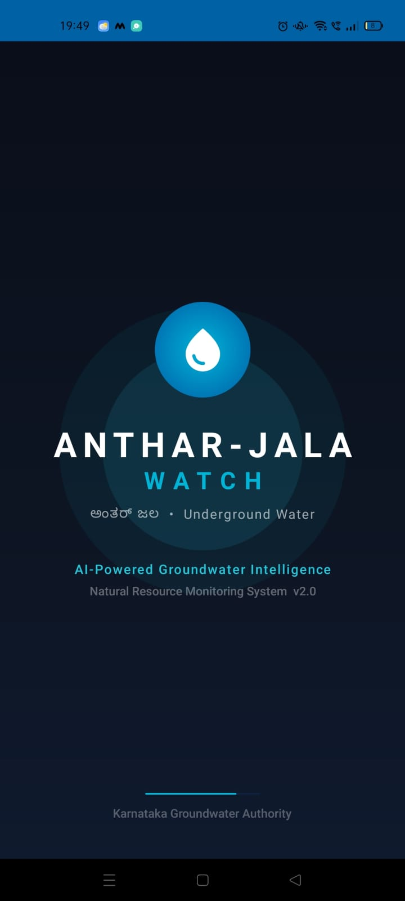
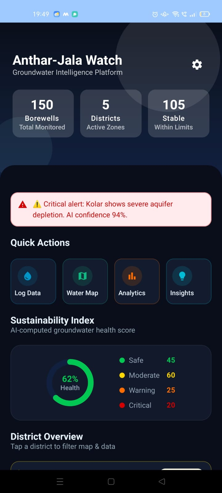
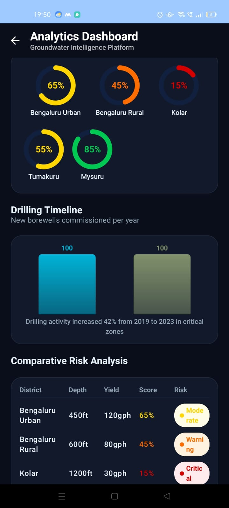
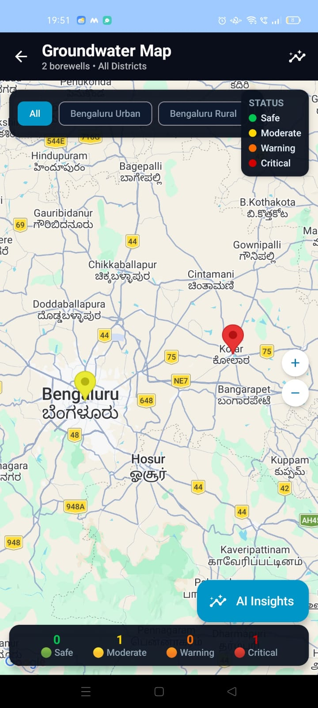

# 🌊 Anthar-Jala Watch

Anthar-Jala Watch is an Android-based groundwater monitoring and borewell analytics application designed to help users log borewell data, analyze groundwater conditions, and generate AI-driven insights for sustainable water management.

The project focuses on combining modern Android development practices with data-driven groundwater analysis to create a clean, user-friendly, and scalable mobile application.

---

# 📱 Project Overview

Groundwater depletion has become a major challenge in many regions due to increasing borewell usage, irregular rainfall, and lack of proper monitoring systems.

Anthar-Jala Watch was developed to provide a digital platform where users can:

* Log borewell details
* Monitor groundwater-related data
* Analyze water yield trends
* Visualize insights using dashboards
* Access AI-generated groundwater observations
* Improve awareness regarding groundwater sustainability

The application aims to simplify borewell data management while making groundwater information more accessible and understandable.

---

# ✨ Features

## 🔹 Borewell Data Logging

Users can enter:

* Borewell depth
* Water yield
* Year of digging
* District/location details

The application processes the entered information and evaluates groundwater conditions.

---

## 🔹 AI-Based Groundwater Insights

The system generates intelligent observations based on logged borewell data.

Examples include:

* Groundwater condition assessment
* Risk indication
* Sustainability suggestions
* Borewell performance insights

---

## 🔹 Analytics Dashboard

The project includes visual analytics features such as:

* Groundwater trend summaries
* Water yield comparison
* Status categorization
* Borewell statistics
* Performance visualization

---

## 🔹 Interactive UI/UX

The application uses a modern Android UI with:

* Material Design principles
* Responsive layouts
* Smooth navigation
* Animated components
* Dark mode support
* Glassmorphism-inspired interface elements

---

## 🔹 Scalable Architecture

The project was designed using scalable Android development practices to support future enhancements such as:

* Firebase integration
* Real-time synchronization
* Cloud storage
* Notifications
* AI model expansion
* Advanced analytics
* Authentication systems

---

# 🛠️ Tech Stack

## Android Development

* Kotlin
* Android Studio
* Jetpack Compose
* MVVM Architecture

## Database & State Management

* Room Database
* ViewModel
* LiveData / State Management
* Kotlin Coroutines

## UI/UX

* Material Design 3
* Compose Animations
* Custom Components
* Responsive Layout Design

## Version Control

* Git
* GitHub

---

# 🧠 Architecture

The application follows the MVVM (Model-View-ViewModel) architectural pattern.

## Components

### Model

Handles:

* Data models
* Borewell records
* Business logic
* Database entities

### ViewModel

Handles:

* UI state management
* Data processing
* Submission handling
* Groundwater insight generation

### View

Handles:

* User interface
* User interactions
* Screen rendering
* Navigation

This architecture ensures:

* Clean code structure
* Better maintainability
* Scalability
* Separation of concerns

---

# 📂 Project Modules

The project contains multiple functional modules including:

* Home Screen
* Analytics Screen
* Insights Screen
* Map Screen
* Log Data Screen
* Settings Screen
* About Screen
* Splash Screen

Each module was designed independently while maintaining smooth interaction across the application.

---

# 🚀 Installation & Setup

## Prerequisites

Before running the project, ensure you have:

* Android Studio installed
* Android SDK configured
* Git installed
* Internet connection for Gradle sync

---

## Clone the Repository

```bash
git clone https://github.com/YOUR_USERNAME/AntharJalaWatch.git
```

---

## Open the Project

1. Open Android Studio
2. Click on **Open Project**
3. Select the cloned folder
4. Wait for Gradle Sync to complete

---

## Run the Application

1. Connect an Android device or emulator
2. Click **Run ▶** in Android Studio
3. Build and launch the app

---

# 📊 Future Enhancements

The project is designed to support future upgrades such as:

* Real-time groundwater monitoring
* AI-powered prediction models
* Rainfall data integration
* Cloud database synchronization
* Firebase Authentication
* GPS-based live location tracking
* Satellite map integration
* Notification & alert systems
* Community data sharing
* Borewell recommendation system

---

# 🎯 Learning Outcomes

This project helped strengthen practical understanding of:

* Android application development
* Kotlin programming
* MVVM architecture
* UI/UX design principles
* State management
* Database integration
* Debugging & testing
* Software project structuring
* GitHub workflow
* Real-world problem solving

---

# 📸 Screenshots

## Splash Screen


## Home Screen


## Analytics Dashboard



## Log Data Screen


## AI Insight Screen


## Map Screen

---

# 👨‍💻 Developer

**Shafin Mehnaz**

Aspiring Software Engineer passionate about:

* Android Development
* AI & Machine Learning
* Data Analytics
* Intelligent Systems
* Real-world problem solving

GitHub: [https://github.com/ShafinMz08](https://github.com/ShafinMz08)

---

# 📄 License

This project is developed for educational and portfolio purposes.

---

# ⭐ Support

If you liked this project:

* Star the repository
* Share feedback
* Connect on GitHub

Water may be underground… but good engineering should never be hidden. 🌍💧
